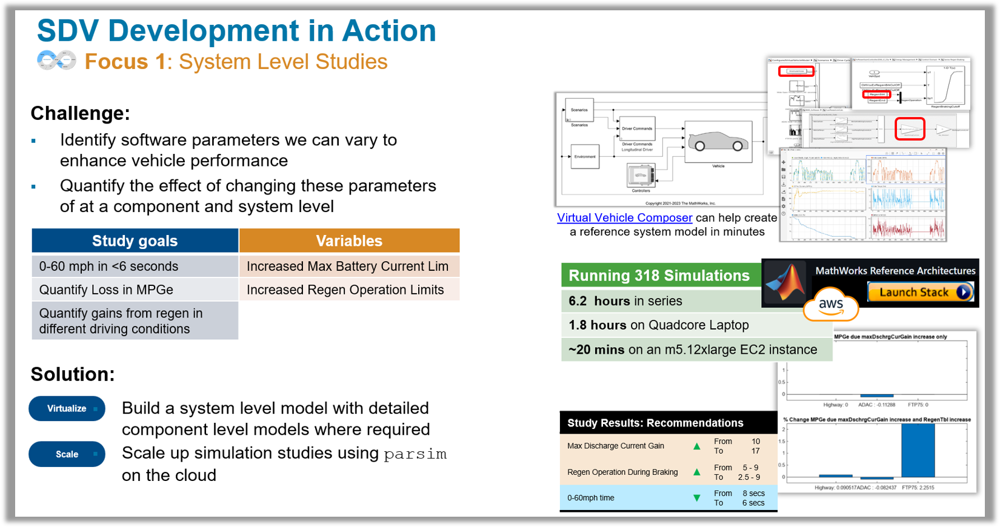

# Dual Motor EV - Running System Level Sims to Create a "Sport+" Mode

*Can we create a sport+ mode for an EV, by making changes **exclusively** to the software controllers?*

-------------   

-------------   

## Relevant Apps/Workflows
- Virtual Vehicle Composer App
- Running Parallel Simulations wtih Parsim
- Using MATLAB and Simulink on the Cloud
- Connect to your Cloud Data (Access S3 buckets)

## Relevant Products
Powertrain Blockset, Parallel Computing Toolbox, MATLAB Parallel Server, Simulink

## Special Instructions
This project can be cloned to your local computer. However, we also assume you will be trying to run this project on a cloud resource, such as an EC2 instance which you create using either [MathWorks Reference Architectures](https://github.com/mathworks-ref-arch) or more easily using using [Cloud Center](https://www.mathworks.com/videos/what-is-mathworks-cloud-center-1651472260634.html). 

### Open and run the Project
1. Open MATLAB
2. Download and install the [Powertrain Blockset Drive Cycle Data](https://www.mathworks.com/matlabcentral/fileexchange/59683-powertrain-blockset-drive-cycle-data) using the Add-on Manager 
2. Clone this repository into a local folder on this remote machine
3. Open the Project `EV_DualMotor_Reference.prj`
4. Using the Project Shortcuts, open the model `ConfiguredVirtualVehicleModel.slx`
5. Simulate the model, and confirm there are no limitations or errors
6. Using the Project Shortcuts, open the Live Script `regenMax_sischrgMax_Study.mlx`
7. Run the script section by section, and confirm you are able to complete the parallel simulation study

### Setup and run the Project on a cloud resource

1. Create and setup access to your AWS or Azure credentials. Instructions to to that are located [here](https://mathworks.sharepoint.com/:w:/r/sites/aeg/teams/parallel_pilot/PCT%20Pilot%20Files/AWS/AWS%20Credentials.docx?d=we810f4a2894c411baf41ecac46d80a0d&csf=1&web=1&e=dBKdgo).This allows you to be able to create cloud computing instances where you can run MATLAB and this project. 
2. Setup your MathWorks Cloud Center by logging into [cloudcenter.mathworks.com](https://cloudcenter.mathworks.com/resource/).
3. Add your AWS/Azure credentials into Cloud Center. 
4. Create a MATLAB EC2 instance, from within the cloud center. The table below specifies the settings you would need to apply to setup and run this simulation.
5. Start the remote instance, either as a remote desktop or using nice DCV (doc [here](https://www.mathworks.com/help/cloudcenter/ug/start-matlab-on-amazon-web-services-aws-using-cloud-center.html#mw_fc949b01-2953-4864-bca2-b1f287618de7)).
6. On the remote instance, Open MATLAB and login using your MathWorks Credentials

**Creating a Cloud Resource from Cloud Center**
| Config Property       | Value                         |
| -------------         | -------------                 |
| Name                  | R23a_System_Simulation_Study  |
| Release               | R2023a                        |
| Operating System      | Windows                       |
| Description           | R2023a                        |
| Instance Type         | General Purpose (m5.12xlarge, 24 core, 48vCPU, 192 GiB RAM)  |
| Auto-Shurdown (hrs)   | 8 hours                       |
| VPC                   | 10.0.0.0/16ae-vpc             |
| Remote Desktop Access | *xx.xx.xxx.xxx*/32 ([Lookup your public IP address and enter it in this field](https://www.google.com/search?q=Whats+My+IP))          |
| AWS Key Pair          | Create and add a keypair      |   

(All other fields can be left at their default value)

&nbsp;

## Recording
(To be added in soon)

## Contact
Sameer K Muckatira

## Relevant Industries
Automotive, AeroDef, anyone looking to run system level studies using `parsim`